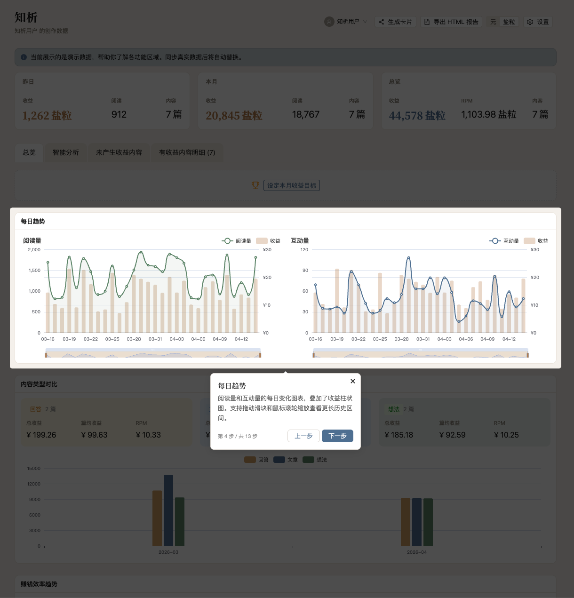

# 知析 — 知乎致知计划智能收益分析

> 一款 Chrome 扩展，帮助知乎创作者深度分析致知计划收益数据，发现收益规律，预测未来趋势。


## 功能亮点

### 智能数据同步

自动采集知乎收益、内容指标和实时汇总数据，支持多日批量同步。

<!-- TODO: 替换为真实截图 -->
<!--  -->

### 多维度数据面板

20+ 可定制分析面板，支持拖拽排列，涵盖日收益趋势、内容对比、周期性分析等。

<!-- TODO: 替换为真实截图 -->
<!--  -->

### ML 收益预测

内置随机森林、岭回归和 TensorFlow.js 神经网络模型，集成学习预测未来收益走势。

<!-- TODO: 替换为真实截图 -->
<!--  -->

### 内容深度分析

支持文章、回答、想法三种内容类型，按收益/阅读/互动多维排名，识别未变现内容。

<!-- TODO: 替换为真实截图 -->
<!--  -->

### RPM 预测与异常检测

千次阅读收益预测，自动发现收益异常波动。

<!-- TODO: 替换为真实截图 -->
<!--  -->

### 收益目标追踪 & 数据导出

设定月度目标可视化进度，一键导出 Excel 完整收益记录。

<!-- TODO: 替换为真实截图 -->
<!--  -->

## 快速开始

### 安装

1. 克隆仓库

```bash
git clone https://github.com/chouheiwa/zhihu-analysis.git
cd zhihu-analysis
```

2. 安装依赖

```bash
npm install
```

3. 构建扩展

```bash
npm run build
```

4. 加载到 Chrome

   - 打开 `chrome://extensions`
   - 开启「开发者模式」
   - 点击「加载已解压的扩展程序」，选择 `dist/` 目录

### 使用

1. 登录知乎后，点击浏览器工具栏中的知析图标
2. 点击「同步数据」，等待数据采集完成
3. 点击「打开面板」进入完整的数据分析仪表盘
4. 首次使用会有引导教程，帮助你了解各项功能

## 技术架构

- **前端**：React 18 + TypeScript + Ant Design
- **构建**：Vite + @crxjs/vite-plugin（Chrome Extension MV3）
- **数据可视化**：ECharts
- **机器学习**：TensorFlow.js + ml-random-forest + 岭回归
- **本地存储**：Dexie（IndexedDB）
- **数据导出**：xlsx

**三层架构**：

- **Service Worker** — 消息路由、数据同步调度
- **Content Script** — 通过 fetch bridge 绕过 CORS 访问知乎 API
- **UI 层** — Popup（快捷操作）+ Dashboard（完整分析面板）

## 开发指南

```bash
npm run dev           # 启动开发服务器（热更新）
npm test              # 运行测试
npm run test:coverage # 测试覆盖率报告
npm run lint          # ESLint 检查
npm run format        # Prettier 格式化
```

项目使用 Husky + lint-staged，提交代码时自动执行 ESLint 和 Prettier 检查。

## 贡献指南

欢迎提交 Issue 和 Pull Request！

1. Fork 本仓库
2. 创建功能分支：`git checkout -b feat/your-feature`
3. 提交代码，确保通过 lint 和测试
4. 提交 PR，描述你的改动内容和动机

### 提交规范

使用 [Conventional Commits](https://www.conventionalcommits.org/) 格式：

- `feat`: 新功能
- `fix`: 修复 Bug
- `refactor`: 重构
- `docs`: 文档
- `test`: 测试
- `chore`: 构建/工具链

## 开源协议

本项目基于 [GPL-3.0](LICENSE) 协议开源。
