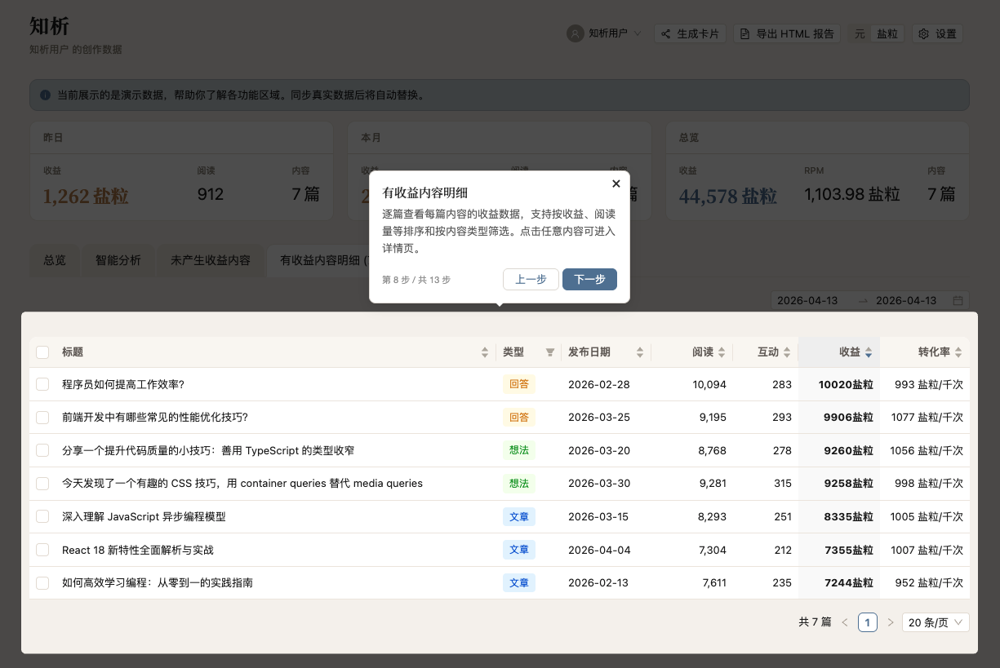
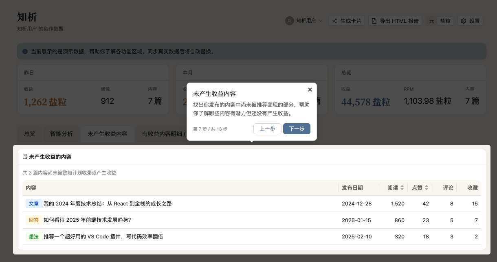
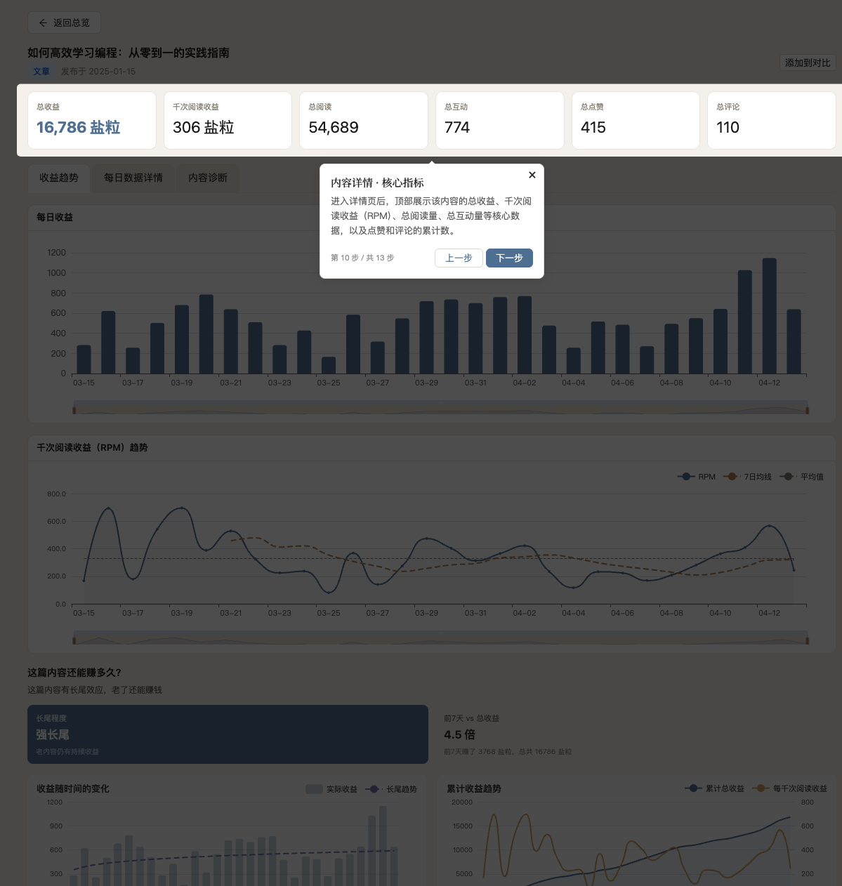
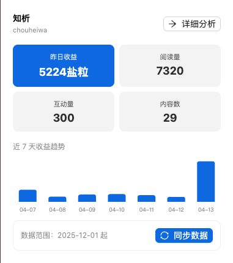
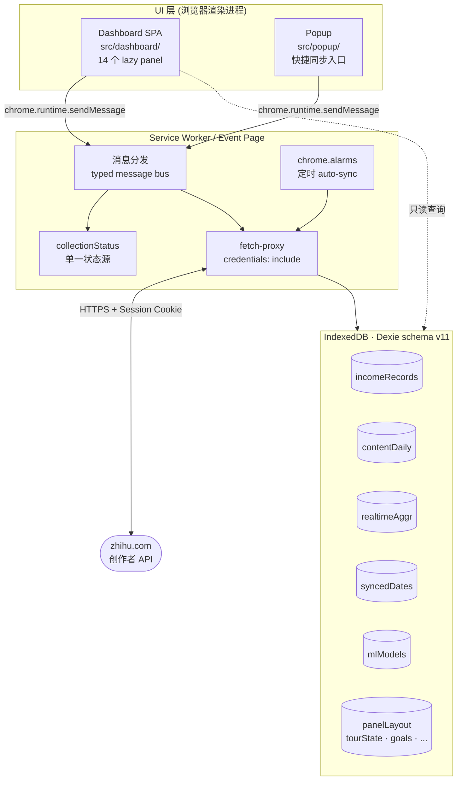

# 知析 — 知乎致知计划收益分析

> 一款本地运行的浏览器扩展，把知乎创作者后台分散的收益、内容和实时数据抓回 IndexedDB，做可视化分析、ML 预测与异常检测。**所有数据只留在你自己的浏览器里**，不经过任何第三方服务器。


---

## 它解决什么问题

知乎创作者后台的分析页面信息分散：收益在「致知计划」、阅读/互动在「内容分析」、实时数据又是另一个页签，而且只能按天查看，拿不到长周期趋势，也没有跨内容对比、没有预测、没法导出。

知析用你登录后的 session 直接调用这些创作者 API，把数据增量抓到本地 IndexedDB，然后在一个独立的 Dashboard 里做你想做的所有分析。**所有请求都由浏览器自身发出，扩展本身不代理、不上传、不存储任何凭据**。

## 主要功能

### 数据同步与本地持久化

- 按日批量采集收益记录、每日内容指标、实时汇总三套数据，支持增量回填已同步的日期会自动跳过
- `chrome.alarms` 定时后台自动同步；打开知乎标签页时也会顺带触发
- 全部写入 IndexedDB（Dexie schema v11），卸载扩展即清除

### 14 个可定制分析面板

可拖拽排序、按标签页分组、支持隐藏/重置。覆盖：

- **总览**：日收益趋势、收益构成、内容类型对比、RPM（千次阅读收益）
- **内容明细**：多维排名、未变现内容识别、ContentDetail 页的漏斗/归因/弹性分析
- **机器学习**：Random Forest + 岭回归 + MLP 三模型集成，给出月度预测和 feature importance
- **周期性**：周内季节性、发布时间热力图、异常检测

### ML 预测

- 针对月收益的 ensemble 模型：`ml-random-forest` + 自研 Ridge + TF.js MLP 加权融合
- 针对当日实时指标的轻量 realtime 模型：基于前一天收益 + 今日阅读/点赞/评论/收藏预测当日收益
- 训练好的模型持久化到 IndexedDB `mlModels` 表，下次打开 Dashboard 直接加载复用

### 内容诊断

在单篇内容的 Detail 页里：

- RPM 趋势线 + EMA 平滑 + Holt 一周预测
- 基于弹性分析（log-log 回归）的收益归因，避开 NNLS 共线性问题
- 漏斗分析（展示量 → 阅读 → 互动 → 收益）对比账号基准
- 高峰节律识别，找出单篇内容的黄金窗口期

### 收益目标 & 报告导出

- 按月设定目标，Dashboard 显示达成度和日均进度
- 一键导出 xlsx 完整记录；也可以生成自包含的 HTML 收益报告
- 支持 **盐粒 / 元** 两种货币单位实时切换

## 界面预览

> 以下截图均来自内置 Demo 模式的合成数据，未包含任何真实账号信息。








## 隐私承诺

- 不向任何第三方服务器发送请求
- 所有对 `zhihu.com` 的调用都由浏览器发出，扩展不拦截、不代理、不记录 Cookie
- 本地数据存储在 `chrome-extension://...` 的私有 IndexedDB，随扩展卸载一起清除
- Chrome 权限：`storage / tabs / alarms / notifications` + `https://www.zhihu.com/*`
- Firefox 下 `host_permissions` 是**可选权限**，首次使用时扩展会弹出 `chrome.permissions.request` 让你显式授权

## 安装

### Chrome / Edge — 开发版（从源码构建）

```bash
git clone https://github.com/chouheiwa/zhihu-analysis.git
cd zhihu-analysis
yarn install --frozen-lockfile
yarn build
```

然后打开 `chrome://extensions` → 开启「开发者模式」→ 加载 `dist/` 目录。Edge 同理，在 `edge://extensions` 下操作。

### Firefox — 开发版

```bash
yarn build:firefox        # 先跑 yarn build，再重新打包 service worker
yarn run:firefox          # 在 Firefox Developer Edition 中临时加载（热重启）
# 或者:
yarn package:firefox      # 产出可上传 AMO 的 .zip
```

Firefox 115 ESR 不支持 `background.type: "module"`，所以构建脚本会用 esbuild 以 IIFE 格式重新打包 service worker。完整发布流程见 [`docs/firefox-release.md`](docs/firefox-release.md)。

### 应用商店（计划中）

发布到 Chrome Web Store / Edge Add-ons / Firefox AMO 的流程已经接入 CI — 打 `v*` tag 即自动构建并提交。等首版审核通过后这里会补上商店链接。

## 快速上手

1. 登录知乎，保持浏览器里有有效的 session
2. 点击工具栏的知析图标 → 弹窗里首次会引导你填写采集起始日期
3. 点「同步」等数据拉取完成（回填若干天的话可能要 1-2 分钟）
4. 打开 Dashboard，首次进入会有引导式 Tour 演示所有面板
5. 没有数据也能体验：打开 Demo 模式（Dashboard 右上角）用合成数据看所有图表长什么样



## 技术架构



**技术栈**：

| 层 | 选型 |
|---|---|
| UI | React 18 + Ant Design v6 + ECharts |
| 语言 | TypeScript strict |
| 构建 | Vite 5 + `@crxjs/vite-plugin` |
| 本地存储 | Dexie (IndexedDB) |
| 机器学习 | `@tensorflow/tfjs` + `ml-random-forest` + 自研 NNLS/Ridge |
| 拖拽 | `@dnd-kit` |
| 导出 | `xlsx` + 自包含 HTML 报告 |
| 测试 | Vitest + `fake-indexeddb` + `@testing-library/react` |

**关键设计**：

- **Store 模块封装**：所有 IndexedDB 查询走 `src/db/*-store.ts`，组件不直接 `db.table.where()`，方便测试 mock
- **fen 整数货币**：DB 和 API 层一律用「分」为单位存整数，显示层通过 `useCurrency()` Context 转换，不会散落 `/100` 魔法数
- **单一状态源**：service worker 持有 `isCollecting / progress` 等状态，UI 查询而非维护，避免并发冲突
- **Panel registry**：加新面板只需在 `panel-registry.ts` 里注册一行，自动出现在布局定制器里
- **`stats.ts` 是统计库**：Pearson/Spearman 相关、NNLS/Ridge 回归、弹性分析、Holt 预测、异常 z-score 等，实现在一个文件，别的地方不要自己造轮子

## 开发

```bash
yarn dev             # Vite dev server (HMR)
yarn build           # 生产构建 → dist/
yarn test            # Vitest (watch)
yarn test:coverage   # 覆盖率，门槛 lines 80 / funcs 60 / branches 75 / stmts 80
yarn lint            # ESLint
yarn type-check      # tsc --noEmit
yarn format          # Prettier

yarn build:firefox   # 产出 Firefox 包到 dist-firefox/
yarn lint:firefox    # web-ext lint
```

Husky + lint-staged 会在 commit 时自动跑 `eslint --fix` 和 `prettier --write`，请不要用 `--no-verify` 绕过，而是修好根因。

测试现状：591 个测试，全部绿，覆盖 Service Worker 消息流、Dashboard hooks、Dexie store、ML 模型、统计函数等。

## 贡献

欢迎 Issue 和 PR。流程：

1. Fork → `git checkout -b feat/your-feature`
2. 改代码、加测试，确保 `yarn lint && yarn type-check && yarn test` 全绿
3. 按 [Conventional Commits](https://www.conventionalcommits.org/) 写 commit message：`feat / fix / refactor / docs / test / chore / perf / ci`
4. 开 PR，描述改动动机和影响面

更详细的代码约定在 [`CLAUDE.md`](CLAUDE.md) 里。

## 开源协议

[GPL-3.0](LICENSE)。衍生作品必须同样开源。
